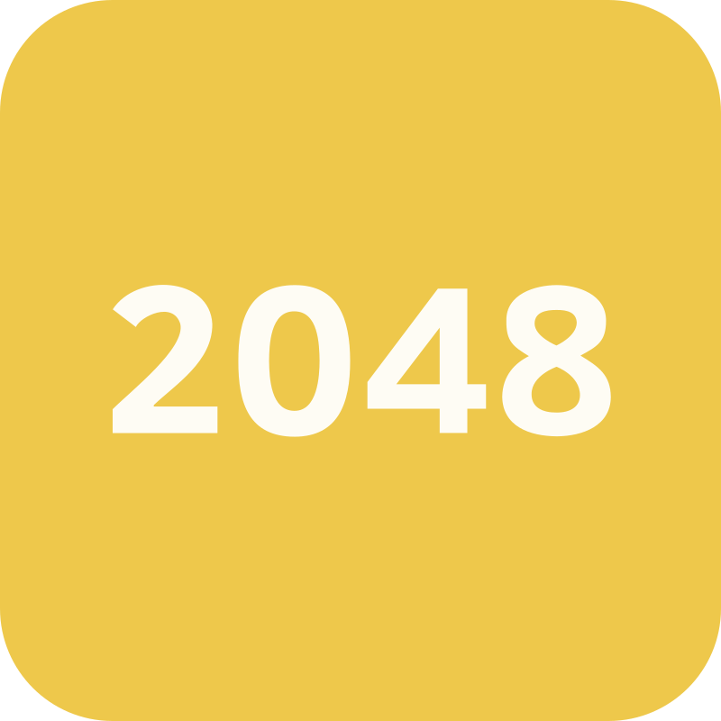

<!-- PROJECT SHIELDS -->
<!--
*** I'm using markdown "reference style" links for readability.
*** Reference links are enclosed in brackets [ ] instead of parentheses ( ).
*** See the bottom of this document for the declaration of the reference variables
*** for contributors-url, forks-url, etc. This is an optional, concise syntax you may use.
*** https://www.markdownguide.org/basic-syntax/#reference-style-links
-->

<!-- PROJECT LOGO -->
 

  <h2 align="center">2048</h2>
  

  

    Can you reach 2048 or beyond ? 

    We have developed a version of the 2048 game in C++, during a 2 weeks project at LaPlateforme(Marseille).

  

<!-- TABLE OF CONTENTS -->

  
Table of Contents

  <ol>
    <li>
      <a href="#about-the-project">About The Project</a>
      <ul>
        <li><a href="#built-with">Built With</a></li>
      </ul>
    </li>
    <li><a href="#contributor">Contributor</a></li>
    <ul>
        <li><a href="#contributing">Contributing</a></li>
    </ul>
  </ol>

<!-- ABOUT THE PROJECT -->
## About The Project

2048 is a strategic puzzle game created by Gabriele Cirulli in March 2014.
The goal is to combine numbered tiles to reach the number 2048.
Players move tiles on a 4x4 grid, merging them to create higher numbers.
Each move requires careful planning and strategy. The game is open-source and was first released on GitHub.

The project was divided in 3 parts for lunching the game: 

1/ In the terminal
2/ With SDL2 librairy
3/ With SFML librairy 

(<a href="#readme-top">back to top</a>)

### Built With

* C++ 
* SFML
* SDL

(<a href="#readme-top">back to top</a>)

<!-- CONTACT -->
## Contributor

- **Barbara VANNI** (<a href="https://github.com/barbara-vanni">github</a>)

- **Walid SAAD EL KHALK** (<a href="https://github.com/walid-saadelkhalk">github</a>)

- **Mathis SERRA** (<a href="https://github.com/mathis-serra">github</a>)

(<a href="#readme-top">back to top</a>)

<!-- CONTRIBUTING -->
#### Contributing

<h6>
Contributions are what make the open source community such an amazing place to learn, inspire, and create. Any contributions you make are greatly appreciated.

If you have a suggestion that would make this better, please fork the repo and create a pull request. You can also simply open an issue with the tag "enhancement".
Don't forget to give the project a star! Thanks again!

1. Fork the Project
2. Create your Feature Branch (`git checkout -b feature/AmazingFeature`)
3. Commit your Changes (`git commit -m 'Add some AmazingFeature'`)
4. Push to the Branch (`git push origin feature/AmazingFeature`)
5. Open a Pull Request
</h6>

(<a href="#readme-top">back to top</a>)
